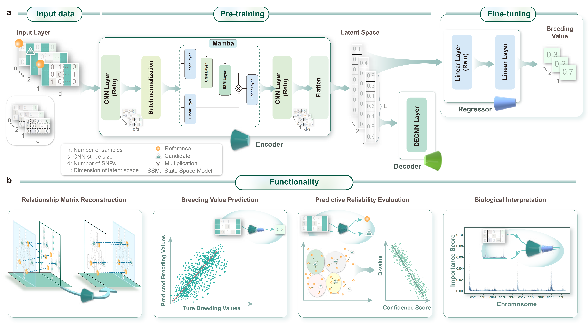

# CMD Genotype-Phenotype Association Analysis based on Mamba2 

## Project Overview 🥕 

CMD is a deep learning project based on the Mamba2 architecture for genotype-phenotype association analysis. This project combines convolutional neural networks with Mamba state space models to process large-scale genomic data and predict phenotypic traits.

## Project Structure

```
CMD/
├── config.py              # Configuration file
├── requirements.txt        # Dependencies
├── data/                   # Data processing module
│   ├── data_utils.py       # Data loading and preprocessing utilities
│   ├── data_loder.py       # Data loader
│   └── vcf_to_csv.py       # VCF format conversion tool
├── model/                  # Model definitions
│   ├── model_utils.py      # Model architecture and utility functions
│   ├── pretrain_model.py   # Pre-training model
│   └── get_bv.py           # Breeding value prediction model
├── train/                  # Training module
│   ├── train.py            # Main training script
│   ├── cross_train.py      # Cross-validation training
│   └── evaluation_utils.py # Evaluation utilities
├── confidence/             # Confidence analysis
│   └── confidence_analysis.py
├── tutorial/               # Tutorials and examples
│   ├── test.ipynb          # Basic testing
│   ├── predict_bv.ipynb    # Breeding value prediction example
│   ├── interpretive_analysis.ipynb  # Interpretive analysis
│   └── confidence_analysis.ipynb     # Confidence analysis example
└── dataset/                # Example datasets
    ├── simulate_geno.csv   # Simulated genotype data
    ├── simulate_pheno.txt  # Simulated phenotype data
    ├── test_geno.csv       # Test genotype data
    └── test_pheno.csv      # Test phenotype data
```

## Core Features

### 1. Data Processing
- Support for multiple genotype data formats (CSV, VCF, etc.)
- VCF to CSV format conversion tools
- Data preprocessing and standardization
- Missing value handling
- Data augmentation and simulation

#### Data Format
- **Genotype Data**: CSV format with samples as rows, SNPs as columns
- **Encoding**: 0 (homozygous reference), 1 (heterozygous), 2 (homozygous alternative), -1 (missing)
- **Phenotype Data**: CSV format with sample IDs as index and continuous values

#### VCF to CSV Conversion
To convert VCF files to the required CSV format:
```bash
python data/vcf_to_csv.py
```
This script handles:
- VCF genotype format conversion (0/0, 0/1, 1/1 → 0, 1, 2)
- Missing data handling (./. → -1)
- Sample numbering and variant ID generation

### 2. Model Architecture
- **CMD-AutoEncoder**: Convolutional and Mamba-based autoencoder
- **CMD-Predictor**: Genotype to phenotype prediction model
- **Pre-training mechanism**: Support for unsupervised pre-training

### 3. Training and Evaluation
- Cross-validation training
- Early stopping mechanism
- Model evaluation metrics
- Confidence analysis

### 4. Interpretive Analysis
- Integrated gradients analysis
- Feature importance assessment
- Visualization tools

## Quick Start

### Environment Setup

```bash
# Install dependencies
pip install -r requirements.txt
```

### Basic Usage

1. **Data Preparation**
   
   **If you have VCF format data, convert it first:**
   ```bash
   python data/vcf_to_csv.py
   ```
   
   **Load your data:**
   ```python
   from data.data_utils import load_genotype_data
   from config import Config
   
   # Load genotype data (CSV format)
   genotype_data = load_genotype_data('./dataset/test_geno.csv')
   
   # Data format requirements:
   # - Genotype: samples × SNPs matrix (values: 0, 1, 2, or -1 for missing)
   # - Phenotype: CSV with sample IDs and continuous values
   ```

2. **Model Training**
   ```python
   from train.train import train
   from model.model_utils import CMDModel
   
   # Create model
   model = CMDModel(Config.IN_CHANNELS, Config.OUT_CHANNELS)
   
   # Start training
   train(epoch, model, device, optimizer, criterion, train_loader, test_loader)
   ```

3. **Prediction and Evaluation**
   ```python
   from model.get_bv import predict_bv
   
   # Predict breeding values
   predictions = predict_bv(model, test_data)
   ```

## Configuration

Main configuration parameters in `config.py`:

- **Data Configuration**: Input file paths, maximum rows, missing ratios, etc.
- **Model Configuration**: Input/output channels, kernel sizes, Mamba parameters, etc.
- **Training Configuration**: Batch size, learning rate, training epochs, etc.
- **Analysis Configuration**: Cross-validation folds, feature importance analysis parameters, etc.

## Tutorials and Examples

Check the Jupyter notebook files in the `tutorial/` directory:

- `test.ipynb`: Basic functionality testing
- `predict_bv.ipynb`: Complete breeding value prediction workflow
- `interpretive_analysis.ipynb`: Model interpretability analysis
- `confidence_analysis.ipynb`: Confidence analysis

## Requirements

### Core Dependencies
- Python 3.10.12
- PyTorch 2.0.1 
- NumPy >= 1.24.0
- Pandas >= 2.2.0
- SciPy >= 1.11.0
- scikit-learn >= 1.3.0
- mamba-ssm 2.2.2
- causal-conv1d 1.4.0
- triton 2.1.0
- matplotlib >= 3.8.0
- seaborn >= 0.13.0
- tqdm >= 4.64.0
- pygam 0.10.1

### Installation
```bash
# Install all dependencies
pip install -r requirements.txt

# Note: For GPU support, ensure PyTorch with CUDA is installed
# Visit https://pytorch.org/ for installation instructions
```

## Notes

1. Ensure sufficient GPU memory for training large-scale models
2. Data preprocessing may take considerable time; SSD storage is recommended
3. Model checkpoints are automatically saved during training
4. Supports robustness analysis under various missing rates

## License

This project follows the corresponding open source license. Please check the LICENSE file in the project root directory for specific information.
